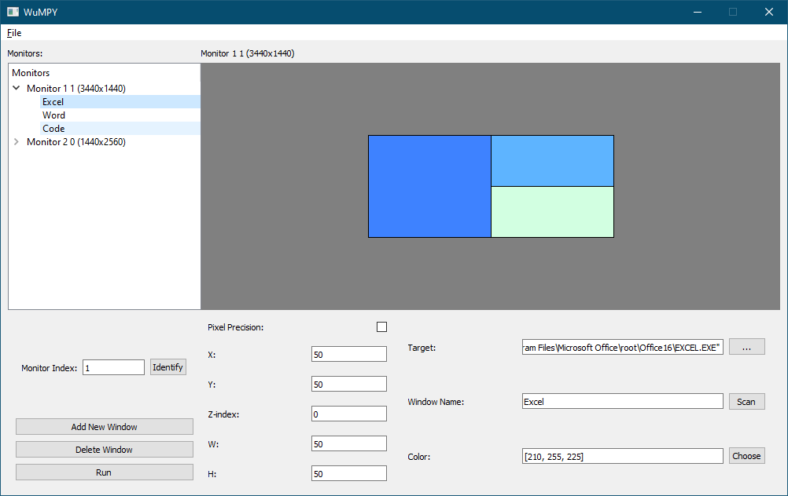

# WuMPY

WuMPY is a Window Manager created in Python3 for snapping windows and launching preset applications in a workspace. 
<p align="center">
   
   
</p>

## Instructions
A workspace contains windows that'll be open on the desktop all at once. For example, a work based workspace may contain an Excel sheet, Spotify, Email, and Zoom.
<br>Workspaces support multiple monitors and are generalizable to different monitor sizes. 
<br>

####Windows Properties:
* <b>X/Y Position</b> - top left position of the window on the desktop. For relative or absolute position, see Pixel Precision.
* <b>Z-index</b> - A window with a higher Z-index will display in front of windows with a lower Z-index. To keep your workspace general to all monitors, you should not use pixel precision.
* <b>Pixel Precision</b> - If enabled, will enable absolute positions and sizes. Otherwise it'll use percentages for relative positions.
* <b>Window Name</b> - Used to determine which window to move.
* <b>Regex Search for Window Name</b> - Use a regex expression to search for window names. Useful for windows like Chrome that change names depending on the current tab.
* <b>Target</b> - If WuMPY couldn't find the window specified by 'Window Name' it'll run this command. Usually just the file location for the window, but can be any command.
* <b>Color</b> - comma separated RGB, purely for organization.

####Monitor Properties:
* <b>Monitor Index</b> - Used to override which monitor the workspace will be applied to. There shouldn't be a need to modify this right now as it's automatically set.  
* <b>Add New Window</b> - Add a new window to the selected monitor.
* <b>Delete Window</b> - Delete the selected window.

####Workspace:
* <b>Retry Time (Seconds)</b> - How long the program should try and move/resize the windows if they're not immediately detected. Useful if the program isn't already open or has a splash screen (Recommend > 0).
* <b>Run</b> - Run the program and apply the workspace to your desktop. Can also be run from headless from the command line.


## Usage

```python
# GUI
py main.py

# Headless Auto-run
py main.py my_workspace
```

## Todo
- Create a new Virtual Desktop
- Custom Monitor dimensions
- Auto detect windows on screen to create workspace
- Drag window in canvas
- Validators for text fields.
- click window in canvas to select
